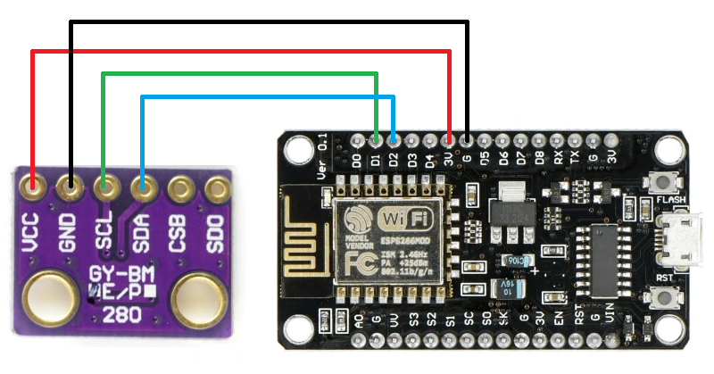

# ESP8266 Sensor

A temperature and humidity sensor designed for home applications. It takes measurements at specified intervals and sends them to a configured topic. Measurement data is transmitted using the MQTT protocol (requires a Wi-Fi connection). Additionally, the sensor features easy configuration via a web server interface.

Components used in project:

- [ESP8266 WIFI Module](https://botland.com.pl/moduly-wifi-esp8266/8241-modul-wifi-esp8266-nodemcu-v3-5904422300630.html)
- [BME280](https://botland.com.pl/czujniki-cisnienia/11803-bme280-czujnik-wilgotnosci-temperatury-oraz-cisnienia-110kpa-i2cspi-33v-5904422366179.html)

## Wires

| BME280 | | ESP8266 |
|--|--|--|
| VCC | -> | 3V |
| GND | -> | G |
| SCL | -> | D1 |
| SDA | -> | D2 |

## Web Server Interface

The web server interface allows for easy sensor configuration. Configuration data is stored in the device's internal memory. Below is a table with parameters that can be configured.

| Name | e.g. value | comment |
|--|--|--|
| Device name | bedroom | Name of the device |
| Interval seconds | 300 | Measurement publishing interval in seconds |
| WiFi SSID | MyWifiSSID | Your Wifi SSID  |
| WiFi Password | TopSecretPassword | Your Wifi Password |
| MQTT Server | 192.168.1.15 | IP adress of the MQTT Broker |
| MQTT Port | 1883 | Port of the MQTT Broker |
| MQTT Main Topic | sensor/ | Main topic for published messages |

**To enable the web server interface, follow these steps:**

- press the Reset Button
- wait for approximately 1 second
- hold down the Flash Button for about 2 seconds and then release it
- connect to the ESP8266 Access Point (e.g., via a mobile phone)
- open a web browser and go to 192.168.1.4

| ESP8266 Access Point Credentials | |
|--|--|
| SSID | ESP8266_AP |
| Password | 12345678 |

## MQTT topic and payload pattern

| Topic | Payload example |
|--|--|
| **MQTT Main Topic**/**Device name**/temperature | 21.3 |
| **MQTT Main Topic**/**Device name**/humidity | 33.2 |
| **MQTT Main Topic**/**Device name**/pressure | 1003.0 |

- *MQTT Main Topic* is specified in the **Web Server Config**
- *Device name* is specified in the **Web Server Config**
